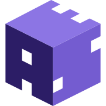

# AES Educational Simulator



(FYP) Online tool for helping 3rd level Computer Science students learn about the Advanced Encryption Standard.

Advisor: Félix Balado (felix@ucd.ie) Student: Logan Czernel (logan.czernel@ucdconnect.ie)

#### Project Structure

```
/
├── public/
│   └── favicon.svg
├── src/
│   ├── components/
│   │   └── Card.astro
│   ├── layouts/
│   │   └── Layout.astro
│   └── pages/
│       └── index.astro
└── package.json
```

#### Commands

| Command                | Action                                             |
| :--------------------- | :------------------------------------------------- |
| `npm run dev`          | Starts local dev server at `localhost:3000`        |
| `npm run build`        | Build production site to `./dist/`            |
| `npm run preview`      | Preview build locally, pre-deploy       |

