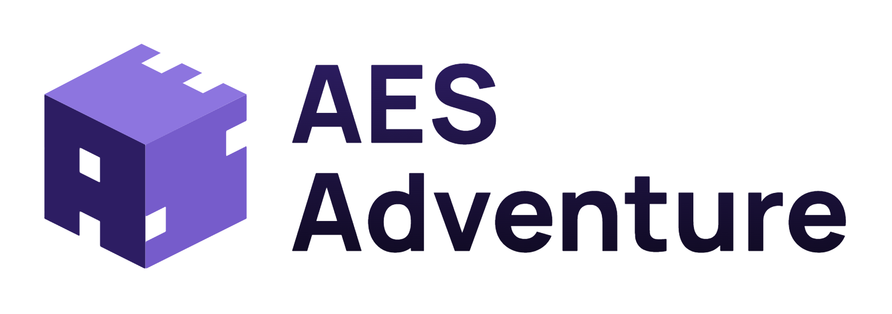

# 

#### 🚀 [https://aes-adventure.web.app](https://aes-adventure.web.app/)
#### 🔎 [Sentry Error Monitoring](https://logans-sentry-of-solitude.sentry.io/projects/aes-adventure-ui/?project=4505047073423360)
#### 📈 [Firebase Usage & Billing](https://console.firebase.google.com/project/aes-adventure/usage)
#### 📖 [Google Cloud Logs](https://console.cloud.google.com/logs/query?authuser=0&project=aes-adventure)
<br/>

Online tool for helping 3rd level Computer Science students learn about the Advanced Encryption Standard.

<i>Student:</i> Logan Czernel (logan.czernel@ucdconnect.ie)<br />
<i>Advisor:</i> Félix Balado (felix@ucd.ie) 


#### Application Structure

```
/
├── aes-adventure-ui
│   ├── assets
│   ├── components
│   │   ├── animation
│   │   └── tutorials
│   │       └── common
│   ├── composables
│   ├── lang
│   ├── layouts
│   ├── pages
│   │   └── simulator
│   ├── plugins
│   ├── public
│   └── utils
│       ├── aesi
│       │   ├── core
│       │   └── test
│       ├── animation
│       └── statistics
│    
├── wiki
│   └── TODO
└── README.md
```


#### Commands

| Command                | Action                                             |
| :--------------------- | :------------------------------------------------- |
| `npm run dev`          | Starts local dev server at `localhost:3000`        |
| `npm run build`          | Builds client and server apps for production        |
| `npm run deploy`          | Deploys to Firebase Hosting + Functions        |
